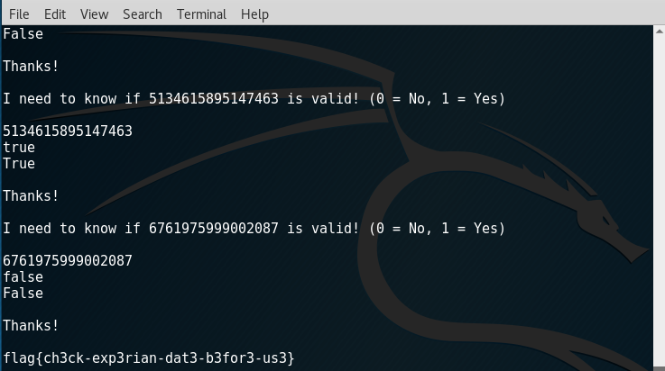

# CSAW Preliminaries 2017 Write Up

## Challenge: CVV 100 points

cvv.py

Overview: connecting to misc.chal.csaw.io on port 8308 begins as series of "asks"; for example:

* I need a new Visa!
* I need a new MasterCard!
* I need a new Discover!

and so on. Passing completely random "card numbers" will not be accepted as it appears they are validating them via the ol' [Luhn Algorithm](https://en.wikipedia.org/wiki/Luhn_algorithm).  
They are also expecting to see valid card type prefixes and lengths. Also, after a few early dry runs, don't use the same card number more than once, they will not accept it. 

After a quick hunt around I came across some python examples which had a decent CC number generator which is what I needed (that I knew so far) for this challenge. Since I knew I had to likely make some tweaks, I just gutted the core code into my python script, really for less hopping back and forth. For my sanity you will see alot of ```print``` statements so I can see what is going on since this rips through pretty quick.

So the first phase of this was asking for a new card 25 times, which you respond to with a new unused card number. 

Then on to the next phase where it asks for cards with a custom 4 digit prefix. This was easy enough to pipe into a variant of the original card number generation routine. 

After a round of those (another 25), it then starts asking for cards that end with a certain single digit.

Instead of messing around with backing into a number via the check number, I just opted to pre-generate a TON of cards, then find what I need in this array, and remove it if I use it (remember only one use per session).

25 of those and then another request for "Cards ending with " a four digit sequence. Again, just used the massive bank of pre-genned numbers to match against. Since it looked like each phase asked for about 25, just playing the odds that my pre-gens will have enough to satisfy what they are asking for.

Thinking we were out of the woods, the last series throws random card numbers at you and want you to answer if it is a valid card number. So had to tack on a function to validate card numbers to process this last batch. When its all said and done you get the flag

### flag{ch3ck-exp3rian-dat3-b3for3-us3}



**Note:** *So I ran into a few runs where they were saying a card wasn't valid, when multiple online validators indicated it was just fine. So not sure exactly how their validation routine is setup as this is a challenge where you don't get the code/binary to analyze, just caught some weird exceptions with card validations*