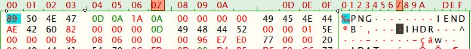
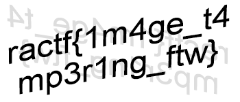

# Really Awesome CTF 2020 Write Up

## Cut Short

### Steg/Forensics Challenge: 200 points

This image refuses to open in anything, which is a bit odd. Open it for the flag!

We are given a [PNG file](./flag.png) to download and analyze. Can't open it as is, time to look under the covers.

Opening it in a HEX editor reveals something very quickly:

Looks like there is a IEND chunk immediately after the PNG header and before the valid IHDR

Clean that mess up properly and you have the flag

## ractf{1m4ge_t4mp3r1ng_ftw}

