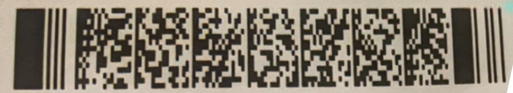

# Really Awesome CTF 2020 Write Up

## RAirways

### OSINT Challenge: 200 points

*Agent. We found a target posting strange images of boarding passes to his Instagram. None of the guys at base can figure it out, but we think he's been using the images to exfiltrate data. We've attached a high-quality version of the image below, here's the one from his Instagram:*

Overview: You are given a screenshot of an Instagram post to provide context to the story, you can also [download the hires version for analysis](./original.jpg)

Looking at the image there are no obvious hints or clues in the background, so lets go with what we have. Originally suspect of the barcode, but looked at pale letters in book cover, nothing there, so back to the barcode.

Can't scan it as is, but thankfully we have the hires version of the image to work with, with a little image manipulation magic with sharpen and more importantly, skew, tools...I was able to get it [pretty straight](./pdf417-straight.jpg). But, something immediately didn't feel right, yep...colors are reversed, so once again a few tweaks and we have a [fully scannable PDF417 2d barcode](./pdf417-color-correct.jpg). Now its just a matter of using either a scanner, a phone app, or an online image barcode reader.

Once you scan the barcode with corrected colors you find the flag in the data

M1TECHY/BEN           EDED833FZRHSFORA A67D 069F035A0007 100
ractf{B0ard1ngP4ssD4t4}

## ractf{B0ard1ngP4ssD4t4}
